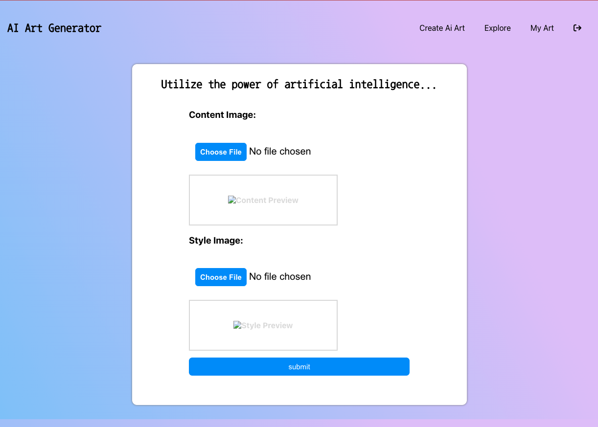
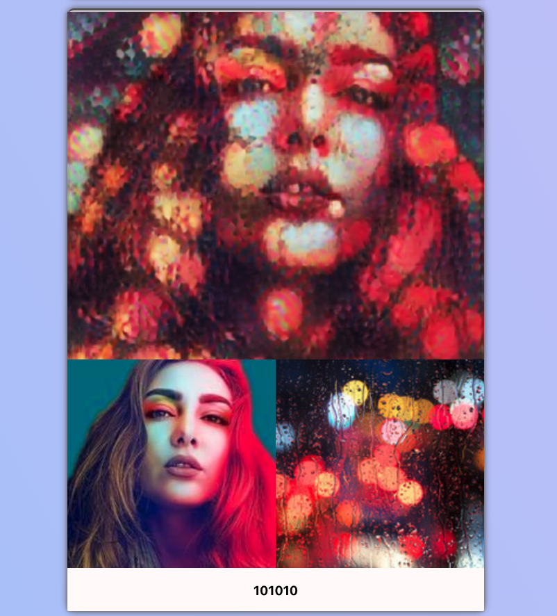

# ***AI art generator*** 

### *Matt Jacobs, Anthony Madia, Eugene Rillo*  

<!-- Deployed area -->
### Deployment Link

## Description

🖌️  Ai art generator is a Flask/Python backend and React frontend application where users can utilize the power of artifical intelligence to style content images.

This application utilizes an arbitrary image stylization algorithm from the Magenta OpenSource project. The project utilizes a machine learning system for performing fast artistic style transfer that works on arbitrary painting styles. Read more about the project [here](https://github.com/magenta/magenta/tree/main/magenta/models/arbitrary_image_stylization)

Check out our [Backend Repo](https://github.com/Euril/ai-art-generator-api) for more information on how we utilize TensorFlow to for image stylization. 

<!-- we can add images of some pages here -->
## Preview
🤖 This page demonstrates where users will be able to choose a Content Image and a Style Image. After clicking 'Submit', the backend receives a request and the image styling is initiated.

🦾 Take a look at an example of what the AI creates with the content image on the bottom left and the style image on the bottom right.

## App Info

## Technologies Used

| ***Cloudinary*** |

## Planning 
Planning through Trello
[https://trello.com/b/YFyGjZMB/ai-nft-art-generator]

## Ice Box / Stretch Goals

- [ ] Add a selection of style images a user can choose from

## Acknowledgments

Cloudinary  
[https://cloudinary.com/]

Fast Style Transfer for Arbitrary Styles  
[https://www.tensorflow.org/hub/tutorials/tf2_arbitrary_image_stylization]

